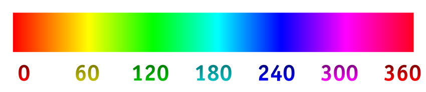

# RGBPlugins for CoreTemp
A CoreTemp plugin [CoreTemp](https://www.alcpu.com/CoreTemp/), that controls your PC RGB LEDs based on the actual CPU temperature and CPU load.
The colors (can be adjusted) are mapped from blue for cold to cyan->green->yellow->Red for Warm up to violet for critical.

The intensity is based on the CPU load (can be disabled).

## Motherboard support. 
The RGBPlugins solution contains two projects. Just use the one that fits your needs:
* **MSI MysticLight**: For MSI boards supporting the MysticLight SDK [MSI SDK](http://download.msi.com/uti_exe/Mystic_light_SDK.zip). You need to install the MSI DragonCenter service with the MysticLight addon.
* **OpenRGB**: For all Boards supported by the open source OpenRGB project [OpenRGB](https://gitlab.com/CalcProgrammer1/OpenRGB). You need to run the OpenRGB package with the Server SDK enabled.
Some considerations:
* The MSI Mysticlight SDK was not relaiable for a long time. Since the latest version (included in the package) it seems to connect fine. One issue (at least on my Motherboard) is that the LEDs briefly flicker every time they get a new setting.
* OpenRGB is a very ambitious new open source project that aims to control all RGB PC devices via one interface. It is not yet very mature (as I speak it is version 0.4). It supports my MSI Motherboard board, but at startup it often doesn’t recognize the RGB hardware. 

## Install notes:
Create a plugins directory in your CoreTemp folder if it not yet exists. e.g.: `C:\Program Files\Core Temp\plugins`
Within that folder, a sub-directory is needed for every CoreTemp plugin. e.g.: `C:\Program Files\Core Temp\plugins\RGB` 
Depending if you have a 32 or 64 bits version of CoreTemp, you copy the 32 or 64 bits version of the RGBplugin into the RGB plugin folder.
If you use the MSI plugin version, the 32 or 64 bits SDK DLL needs to be added there as well.
With a good old INI-file the temperature-color mapping can be adjusted. Just press the configure button in the CoreTemp plugin manager. 
It will launch Notepad with the plugin ini file. 
When Notepad is closed, the new settings wil be loaded. 
In this INI-file both the temperature ranges and the corresponding color ranges can be adjusted: 
```
[OpenRGB_Settings]     // only applicable for the OpenRGB version
OpenRGBIP=127.0.0.1    // default for local host
OpenRGBPort=6742       // the default port for the Open RGB Server 
OpenRGBMode=0          // Needs to be the direct mode, normally the first one
[General_Settings]
ControlIdx=0           // The RGB device index to be used. 
[Core_Temp_Mappings]
TColdBelow=25          // All CPU temps below this threshold have the HUECold color (default is Blue)
TWarm=55               // The CPU Warm temperature (default color RED)
THot=60                // The CPU Hot temperature (default color RED up to this temperature)
TCriticalAbove=80      // The CPU Critical temperature (Violet above this temperature)
[Core_Load_Mappings]
LoadBasedIntensity=1   // Default is 1 where the itensity is based on the CPU load. Set to 0 to disable
ILowPct=10             // Intensity for 0% CPU load
IHighPct=100           // Intensity for 100% CPU load
[Color_HUE360_Mappings]// Colors are defined as a 360 hue circle. Values below 0 or above 360 will work as well! -360=0=360=720 etc
HUECold=240            // Start color (default 240 = Blue)
HRangeCold2Warm=-240   // The HUE range from Cold to Warm. Default -240, (from 240 down to 0 : blue->cyan->green->yellow->Red)
HRangeWarm2Hot=0       // Default no color change between Warm to Hot (all RED)
HRangeHot2Critical=-20 // Default -20 (from 0 down to -20: Red to violet)
```
The HUE 0-360 scale:

The code was compiled, using VS2019 Version 16.6.2
Success.
